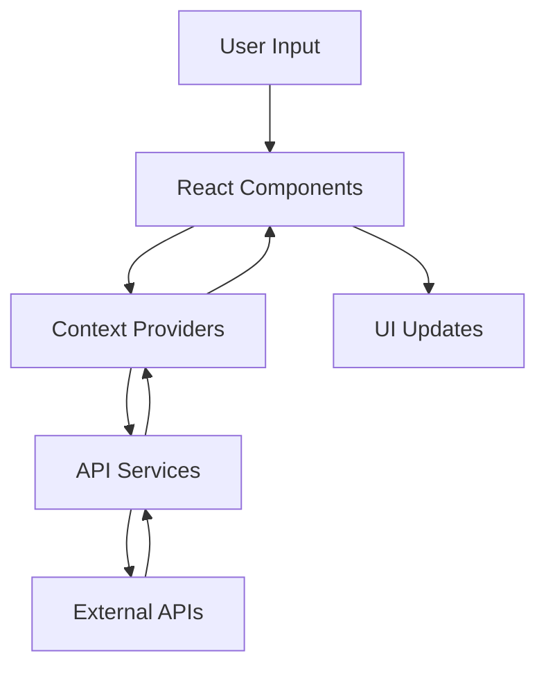
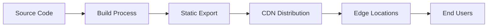

# MyQuran Website Architecture

## System Overview

MyQuran is a modern digital Quran platform built with Next.js, focusing on memorization and study features.

### Core Technologies

- **Frontend**: Next.js 14 with TypeScript
- **Styling**: Tailwind CSS + shadcn/ui
- **State Management**: React Context + Local Storage
- **Animations**: Framer Motion
- **Icons**: Lucide React
- **Build Tool**: Vite
- **Package Manager**: npm

### Key Features

1. Quran Reading Interface
2. Audio Recitations
3. Word-by-word Analysis
4. Advanced Search
5. Bookmarking System
6. Offline Support
7. Personalization Options

## API Architecture

### 1. Quran Data API

Base URL: `https://api.qurancdn.com/api/qdc`

#### Endpoints:

```typescript
// Chapters
GET /chapters
Response: {
  chapters: Array<{
    id: number;
    name_arabic: string;
    name_simple: string;
    verses_count: number;
    revelation_place: string;
    translated_name: {
      name: string;
    }
  }>
}

// Verses by Chapter
GET /verses/by_chapter/{chapterId}
Query Parameters:
  - words: boolean
  - translations: number
  - fields: string
Response: {
  verses: Array<{
    id: number;
    verse_key: string;
    text_uthmani: string;
    translations: Array<{
      text: string;
    }>
  }>
}

// Search
GET /search
Query Parameters:
  - q: string
  - size: number
  - page: number
  - language: string
Response: {
  search: {
    query: string;
    total_results: number;
    current_page: number;
    total_pages: number;
    results: Array<{
      verse_key: string;
      text: string;
      translations: Array<{
        text: string;
      }>
    }>
  }
}
```

### 2. Audio API

Base URL: `https://everyayah.com/data`

#### Audio URL Pattern:
```
/{reciter}/{surah_number}{ayah_number}.mp3
```

Example: `/Abdul_Basit_Murattal_64kbps/001001.mp3`

## Component Architecture

### 1. Layout Components

```typescript
// app/layout.tsx
RootLayout
├── ThemeProvider
├── AudioProvider
├── FontProvider
├── Header
├── Main Content
└── Footer

// components/header.tsx
Header
├── Logo
├── Navigation
├── ThemeToggle
└── MobileMenu

// components/footer.tsx
Footer
├── SiteInfo
├── Navigation
├── DonationDialog
└── SocialLinks
```

### 2. Quran Interface Components

```typescript
// components/quran/
ChapterList
├── ChapterCard
└── ChapterFilters

VerseList
├── VerseCard
│   ├── AudioPlayer
│   ├── Translation
│   ├── WordAnalysis
│   └── VerseActions
└── NavigationControls

AudioPlayer
├── PlaybackControls
├── ProgressBar
├── VolumeControl
└── SpeedControl
```

### 3. Search Components

```typescript
// components/search/
SearchInterface
├── SearchBar
├── SearchFilters
├── AdvancedOptions
└── SearchResults
```

## Data Flow



## State Management

### 1. Audio Context

```typescript
interface AudioSettings {
  reciter: string;
  autoPlay: boolean;
  repeatEnabled: boolean;
  repeatCount: number;
  playbackSpeed: number;
  volume: number;
}

interface AudioContextType {
  globalSettings: AudioSettings;
  updateGlobalSettings: (settings: Partial<AudioSettings>) => void;
}
```

### 2. Font Context

```typescript
interface FontSettings {
  arabicSize: number;
  translationSize: number;
}

interface FontContextType {
  fontSettings: FontSettings;
  updateFontSettings: (settings: Partial<FontSettings>) => void;
}
```

## Database Schema

### 1. IndexedDB Structure

```typescript
interface QuranDBSchema extends DBSchema {
  chapters: {
    key: number;
    value: Chapter;
  };
  verses: {
    key: string;
    value: Verse[];
  };
  audio: {
    key: string;
    value: ArrayBuffer;
  };
  bookmarks: {
    key: string;
    value: Bookmark;
  };
}
```

## Caching Strategy

1. **API Responses**
   - Runtime caching with Workbox
   - Cache-first for static data
   - Network-first for dynamic content

2. **Audio Files**
   - CacheStorage API
   - Progressive loading
   - Preload next verse

## Performance Optimizations

1. **Code Splitting**
   - Route-based splitting
   - Component lazy loading
   - Dynamic imports

2. **Asset Optimization**
   - Image optimization
   - Font subsetting
   - CSS purging

3. **Caching**
   - Service Worker
   - Static asset caching
   - API response caching

## Security Measures

1. **API Security**
   - Rate limiting
   - CORS configuration
   - Input validation

2. **Client Security**
   - XSS prevention
   - CSRF protection
   - Content Security Policy

## Deployment Architecture



## Error Handling

1. **Client-side Errors**
   - Global error boundary
   - API error handling
   - Fallback UI components

2. **Network Errors**
   - Retry mechanisms
   - Offline fallbacks
   - User notifications

## Analytics Integration

1. **User Analytics**
   - Page views
   - Feature usage
   - Error tracking

2. **Performance Metrics**
   - Core Web Vitals
   - Custom metrics
   - Real user monitoring

## Accessibility Features

1. **ARIA Support**
   - Proper labeling
   - Role attributes
   - Focus management

2. **Keyboard Navigation**
   - Focus trapping
   - Shortcut keys
   - Tab order

## Internationalization

1. **Language Support**
   - Arabic (RTL)
   - English (LTR)
   - Dynamic text direction

2. **Translation System**
   - Multiple translations
   - Language switching
   - RTL/LTR handling